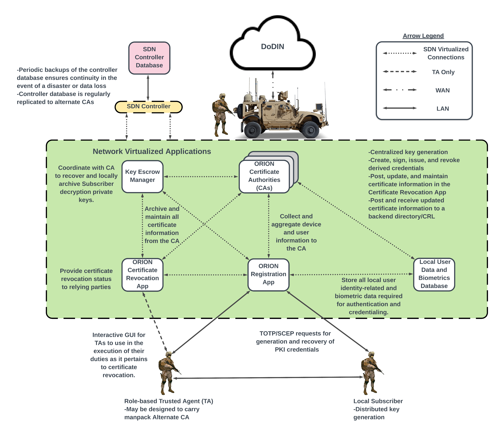
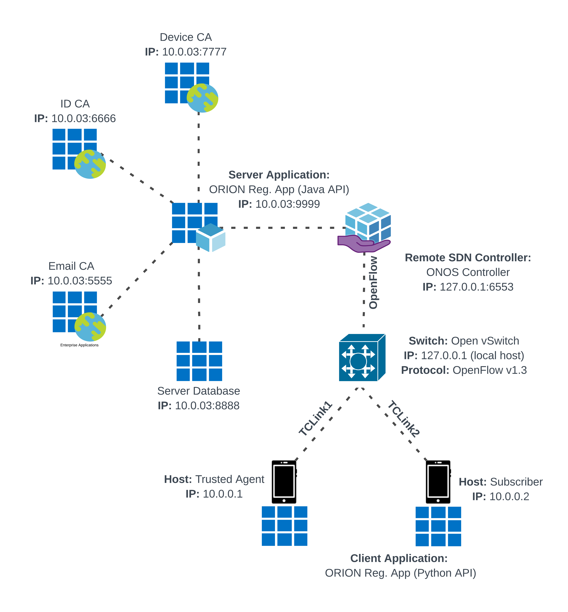
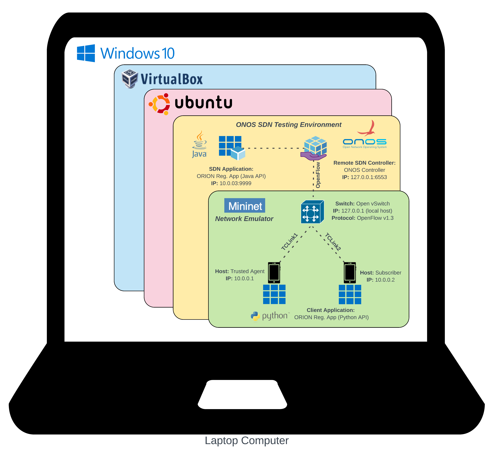
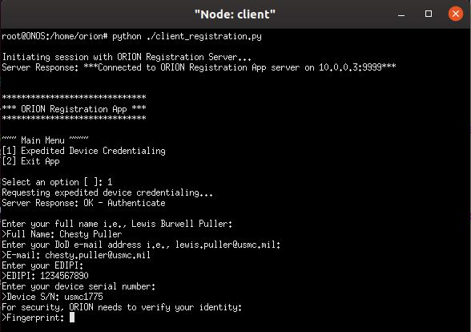

# ORION Registration Application (ORA)

Includes both server and client side applications of the ORA needed to successfuly register and credential a device.

## Getting Started
The following system specifications were used to develop the app:  
 
System Operating System: Windows 10 Pro  
Manufacturer/Model: Acer Aspire E5-576G  
Processor: Intel Core i5-8250U @ 1.6 GHz  
Graphics Coprocessor: NVIDIA GeForce MX150 with 2.00 GB Dedicated GDDR5 VRAM  
Installed Memory (RAM): 8.00 GB Dual Channel Memory DDR4  
Hard Drive: 256 GB SSD  
System Type: 64-bit  
Operating System, x64-based processor  
Hypervisor: Oracle VM VirtualBox 6.0.4r128413 (Qt5.6.2)  
Virtual Machine Operating System: Ubuntu 19.10S  
DN Operating System: Open Network Operating System (ONOS) 2.4.0  
Network Emulator: Mininet 2.2.2  
Packet Analyzer: Wireshark 3.0.5  
Programming Languages: Python 2.7.17 & Java 1.8.0  

### Prerequisites
The project was built in a Linux virtual environment:  

1) Install Mininet Network Emulator  
2) Install Open Network Operating System  
3) Utilize onos-create-app tool to build a new ONOS application, replace the template .java file with AppComponent.java  
4) Install OpenSSL  
5) Install any code-dependent libraries, as required, needed to execute the code (as noted in source code)  

### Installing and Running Tests
Download all source files to working directory.
1) Run ONOS  
2) Run Mininet and deploy toplogy, ensure OpenFlow and Reactive Forwarding is enabled.  
3) Compile and deploy AppComponent.java in ONOS CLI to start up the server-side application.  
4) Execute client_registration.py to start the client-side application.  

## Authors

**Jack Chang** - *Initial work* - https://github.com/usmc-orion/orion

## Acknowledgments

* Dr. Geoffrey Xie
* Dr. Gurminder Singh
* Naval Postgraduate School, Monterey, CA, USA
